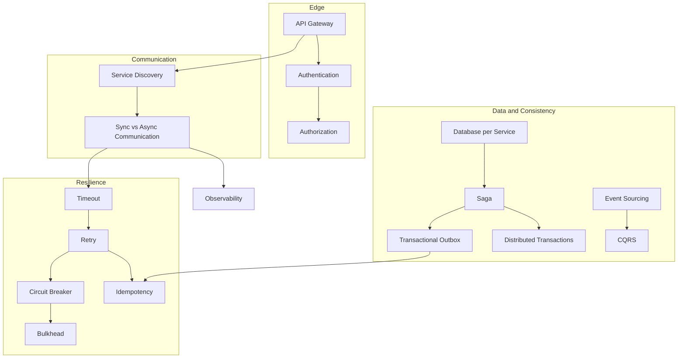

# Microservices Patterns — Architecture Catalogue with TypeScript Reference Implementations

[](https://github.com/shivkumarsinghsky/microservices-patterns/actions/workflows/ci.yml)


A practical catalogue of **17 microservices architecture patterns** by **Shiv Kumar** — API Gateway, Service
Discovery, Database per Service, Saga, Transactional Outbox, CQRS, Event Sourcing, Circuit Breaker, Retry,
Timeout, Bulkhead, Idempotency, Distributed Transactions, Service-to-Service Communication, Authentication,
Authorization and Observability.

Each pattern is documented with the same structure — **Problem, Context, Solution, Architecture, Example,
Advantages, Trade-offs, When to use, When NOT to use** — and a Mermaid diagram. The patterns whose correctness
depends on subtle mechanics (resilience, idempotency, outbox, saga, event sourcing, CQRS, discovery) also have a
small, dependency-free **TypeScript reference implementation with tests**.

The emphasis is on *why* and *when*, not only *how*: the trade-offs and "when NOT to use" sections are as
important as the solutions.

## Pattern Map



## Catalogue

| # | Pattern | Category | Reference code |
|---|---|---|---|
| 01 | [API Gateway](docs/patterns/01-api-gateway.md) | Edge | config example |
| 02 | [Service Discovery](docs/patterns/02-service-discovery.md) | Communication | [`src/discovery`](src/discovery/service-registry.ts) |
| 03 | [Database per Service](docs/patterns/03-database-per-service.md) | Data | schema example |
| 04 | [Service-to-Service Communication](docs/patterns/04-service-communication.md) | Communication | contract examples |
| 05 | [Saga](docs/patterns/05-saga.md) | Consistency | [`src/saga`](src/saga/saga.ts) |
| 06 | [Transactional Outbox](docs/patterns/06-transactional-outbox.md) | Messaging | [`src/outbox`](src/outbox/outbox.ts) |
| 07 | [Distributed Transactions](docs/patterns/07-distributed-transactions.md) | Consistency | comparison + TCC |
| 08 | [CQRS](docs/patterns/08-cqrs.md) | Data | [`src/event-sourcing/projection.ts`](src/event-sourcing/projection.ts) |
| 09 | [Event Sourcing](docs/patterns/09-event-sourcing.md) | Data | [`src/event-sourcing`](src/event-sourcing/work-order.ts) |
| 10 | [Circuit Breaker](docs/patterns/10-circuit-breaker.md) | Resilience | [`src/resilience/circuit-breaker.ts`](src/resilience/circuit-breaker.ts) |
| 11 | [Retry](docs/patterns/11-retry.md) | Resilience | [`src/resilience/retry.ts`](src/resilience/retry.ts) |
| 12 | [Timeout](docs/patterns/12-timeout.md) | Resilience | [`src/resilience/timeout.ts`](src/resilience/timeout.ts) |
| 13 | [Bulkhead](docs/patterns/13-bulkhead.md) | Resilience | [`src/resilience/bulkhead.ts`](src/resilience/bulkhead.ts) |
| 14 | [Idempotency](docs/patterns/14-idempotency.md) | Reliability | [`src/idempotency`](src/idempotency/idempotency.ts) |
| 15 | [Authentication](docs/patterns/15-authentication.md) | Security | JWT verification example |
| 16 | [Authorization](docs/patterns/16-authorization.md) | Security | RBAC example |
| 17 | [Observability](docs/patterns/17-observability.md) | Operations | structured log example |

## Key Capabilities

- Consistent, CI-enforced documentation structure for every pattern (`scripts/check-pattern-docs.mjs`).
- Resilience primitives with injectable clocks for deterministic tests, plus a composed policy
  (`retry → circuit breaker → bulkhead → timeout`, see [ADR-003](docs/decisions/ADR-003-resilience-policy-order.md)).
- Idempotency keys with request fingerprinting, in-progress conflict detection and TTL.
- Transactional outbox with an ordered, at-least-once relay.
- Orchestrated saga with durable progress, crash resumption and compensation-failure handling.
- Event-sourced EAM **work order** aggregate (decide/evolve), optimistic concurrency, and a CQRS projection with
  checkpoints.
- Lease-based service registry with round-robin client-side resolution.

## Architecture

The code follows the same layering in every module: a **pure policy or domain core**, a **small storage
interface** that states the guarantee it needs, and an **in-memory adapter** that honours that guarantee
([ADR-002](docs/decisions/ADR-002-in-memory-adapters-behind-interfaces.md)).

| Module | Responsibility | Production equivalent of the adapter |
|---|---|---|
| `src/resilience` | Timeout, retry with full-jitter backoff, circuit breaker, bulkhead, composition | — (in-process) |
| `src/idempotency` | Key lifecycle, fingerprinting, replay | PostgreSQL `ON CONFLICT DO NOTHING` / Redis `SET NX PX` |
| `src/outbox` | Atomic business write + event, ordered relay | PostgreSQL table + polling or CDC (Debezium) |
| `src/saga` | Orchestrator, saga log, compensations | Saga state table in the orchestrator's DB |
| `src/event-sourcing` | Aggregate, event store, command handler, projection | EventStoreDB, or PostgreSQL append-only table |
| `src/discovery` | Registry with leases, resolver | Consul, Eureka, or Kubernetes Services |

Failure handling is explicit in each module: the outbox relay stops at the first publish failure to preserve
order; the saga marks itself `FAILED` when a compensation cannot succeed; idempotency releases keys on 5xx so the
client can retry; the event-sourced command handler re-decides on concurrency conflicts.

## Technology Stack

| Area | Choice |
|---|---|
| Language | TypeScript 5 (strict, `noUncheckedIndexedAccess`), Node.js 20+ |
| Runtime dependencies | None |
| Tests | Vitest |
| Lint / format | ESLint (typescript-eslint), Prettier |
| Docs | Markdown + Mermaid, validated in CI |

## Repository Structure

```text
microservices-patterns/
├── docs/
│   ├── patterns/        # 17 pattern documents (Problem → When NOT to use)
│   └── decisions/       # ADRs for this repository
├── src/
│   ├── resilience/      # timeout, retry, circuit breaker, bulkhead, composed policy
│   ├── idempotency/     # idempotency keys
│   ├── outbox/          # transactional outbox + relay
│   ├── saga/            # saga orchestrator
│   ├── event-sourcing/  # work order aggregate, event store, command handler, CQRS projection
│   └── discovery/       # service registry + resolver
├── examples/            # runnable scenarios (checkout saga, resilient client)
├── tests/               # Vitest suites per module
└── scripts/             # documentation checks (structure, links, Mermaid)
```

## Getting Started

```bash
git clone https://github.com/shivkumarsinghsky/microservices-patterns.git
cd microservices-patterns
npm ci
npm test
npm run examples
```

`npm run examples` builds the project and runs two scenarios:

- **`examples/checkout-saga.ts`** — idempotent `POST /checkout` → orchestrated saga (reserve stock, authorize
  payment, create order with outbox) → a client retry replayed from the idempotency store → a declined card
  that triggers compensation → the outbox relay publishing committed events.
- **`examples/resilient-client.ts`** — a flaky dependency behind the composed policy, printing retries and the
  circuit breaker moving `CLOSED → OPEN → HALF_OPEN → CLOSED`.

## Configuration

There is no runtime configuration or `.env`: every pattern takes its parameters (thresholds, TTLs, limits) as
constructor options, documented in the source with their trade-offs.

## Usage Example

```ts
import { Bulkhead, CircuitBreaker, resilientCall } from "./src/index.js";

const policy = {
  timeoutMs: 300,
  retry: { maxAttempts: 3, baseDelayMs: 100, maxDelayMs: 1_000 },
  circuitBreaker: new CircuitBreaker({
    name: "pricing",
    failureRateThreshold: 0.5,
    slidingWindowSize: 20,
    minimumCalls: 10,
    openDurationMs: 30_000,
    halfOpenMaxCalls: 3,
  }),
  bulkhead: new Bulkhead({ name: "pricing", maxConcurrent: 20, maxQueue: 50 }),
};

const quote = await resilientCall(policy, (signal) => fetch("http://pricing/quote", { signal }));
```

## Testing

```bash
npm test             # 35 Vitest tests across all modules
npm run typecheck    # tsc --noEmit (strict)
npm run lint         # ESLint + Prettier
npm run check:docs   # pattern structure + internal links
bash scripts/check_mermaid.sh .   # render every Mermaid diagram (downloads mermaid-cli via npx)
```

Tests use injected clocks (`ManualClock`) and injected `sleep`/`random` so time-dependent behaviour — lease
expiry, circuit cool-down, backoff — is deterministic.

## Docker

The library has no long-running service; the Docker setup builds it and runs the two demos without a local Node.js:

```bash
docker compose run --rm checkout-saga       # idempotent API + orchestrated saga + outbox
docker compose run --rm resilient-client    # retry, circuit breaker, bulkhead, timeout
```

`docker/Dockerfile` is multi-stage (TypeScript build, then only the compiled output on `node:22-alpine`, non-root).
Runnable services with a broker and database are in
[event-driven-platform](https://github.com/shivkumarsinghsky/event-driven-platform) and
[enterprise-saas-plateform](https://github.com/shivkumarsinghsky/enterprise-saas-plateform).

## Architecture Decisions

- [ADR-001 — TypeScript for the reference implementations](docs/decisions/ADR-001-typescript-reference-implementations.md)
- [ADR-002 — In-memory adapters behind storage interfaces](docs/decisions/ADR-002-in-memory-adapters-behind-interfaces.md)
- [ADR-003 — Order of composed resilience policies](docs/decisions/ADR-003-resilience-policy-order.md)

## Scalability Considerations

Covered per pattern; the most relevant points:

- **Database per service** and **CQRS** let read and write paths scale independently.
- **Bulkheads** partition capacity so one slow dependency cannot exhaust shared pools.
- **Event-driven communication** with the outbox decouples throughput between producers and consumers.
- **Service discovery** with client-side balancing supports horizontal scaling of stateless services.

## Reliability

Timeouts on every remote call; retries with exponential backoff and full jitter, only for retryable errors;
circuit breakers to fail fast; idempotency keys and idempotent consumers to make retries safe; outbox to remove
dual writes; sagas with durable state and explicit compensation; graceful degradation via fallbacks.

## Security

See [Authentication](docs/patterns/15-authentication.md) and [Authorization](docs/patterns/16-authorization.md):
OIDC/OAuth2 with short-lived JWTs verified at the gateway **and** in services, service-to-service identity via
client credentials or mTLS, permission-based RBAC evaluated where data lives, row-level security as defence in
depth. The codebase has no runtime dependencies, which keeps the supply-chain surface minimal; CI runs
`npm audit` and CodeQL.

## Observability

See [Observability](docs/patterns/17-observability.md): structured JSON logs with trace and correlation ids,
RED/USE metrics, OpenTelemetry tracing with context propagated through message headers, liveness vs. readiness
probes, SLO burn-rate alerts. The circuit breaker exposes `onStateChange` and the bulkhead exposes `stats` as
hooks for metrics.

## Future Improvements

Not implemented yet:

- PostgreSQL adapters for the outbox, idempotency store and event store (with Testcontainers integration tests).
- Snapshotting and event upcasting for the event-sourced aggregate.
- Rate limiter (token bucket) and adaptive concurrency limits.
- Strangler fig and anti-corruption layer patterns for migrating monoliths.

## Related Projects

- [Event-Driven Platform](https://github.com/shivkumarsinghsky/event-driven-platform) — these messaging patterns running against RabbitMQ and PostgreSQL
- [Enterprise SaaS Platform](https://github.com/shivkumarsinghsky/enterprise-saas-plateform) — authentication, tenant-aware RBAC, row-level security
- [System Design Architecture](https://github.com/shivkumarsinghsky/system-design-architecture) — designs that apply these patterns
- [EAM Platform Architecture](https://github.com/shivkumarsinghsky/eam-platform-architecture) — the work order domain used in the event-sourcing example

## Author

**Shiv Kumar** — Senior Software Engineer / Software Architect
GitHub: [github.com/shivkumarsinghsky](https://github.com/shivkumarsinghsky)

## License

[MIT](LICENSE)
