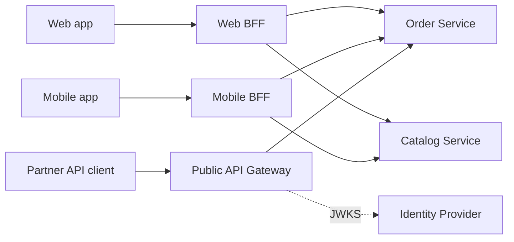

# API Gateway

**Category:** Edge · **Related:** [Authentication](15-authentication.md), [Service Discovery](02-service-discovery.md), [Observability](17-observability.md)

## Problem

Clients (web, mobile, partners) would otherwise need to know the address, protocol and authentication scheme of
every service, make many round-trips per screen, and be broken every time a service is split or renamed.

## Context

A system of independently deployed services exposed to external clients over the internet, where cross-cutting
edge concerns (TLS, authentication, rate limiting, request size limits, CORS) must be applied consistently.

## Solution

Place a single entry point in front of the services. The gateway routes requests by path/host/header, terminates
TLS, validates tokens, applies rate limits and quotas, and injects a correlation id. A **Backend for Frontend
(BFF)** variant gives each client type its own gateway that can aggregate several service calls into one
client-shaped response.

Keep business logic out of the gateway; it should be configuration plus thin, generic filters.

## Architecture



## Example

Typical gateway route configuration (illustrative, Envoy/Kong/YARP-style concepts):

```yaml
routes:
  - match: { prefix: /api/orders }
    cluster: order-service
    timeout: 2s
    retries: { on: [connect-failure, 503], attempts: 2 }   # only idempotent methods
    filters:
      - jwt: { issuer: https://idp.example.com, audiences: [orders-api] }
      - rate_limit: { key: "jwt.sub", requests_per_minute: 600 }
      - request_id: { header: X-Correlation-Id, generate_if_missing: true }
```

## Advantages

- One place to enforce authentication, TLS, rate limiting and request validation.
- Clients are decoupled from internal service topology; services can be split or moved.
- BFFs reduce chattiness for mobile clients and let each client evolve independently.

## Trade-offs

- An extra network hop and a component that must be highly available and scaled.
- Risk of the gateway becoming a "god component" accumulating business logic and becoming a release bottleneck.
- Gateway retries can multiply load if services also retry (see [Retry](11-retry.md)).

## When to use

- External clients consume more than a handful of services.
- Consistent edge security and quotas are required (public or partner APIs).
- Different clients need differently shaped APIs (BFF).

## When NOT to use

- A single service or modular monolith — a reverse proxy/load balancer is enough.
- Internal service-to-service traffic — use service discovery or a service mesh rather than routing everything
  back through the edge gateway.
