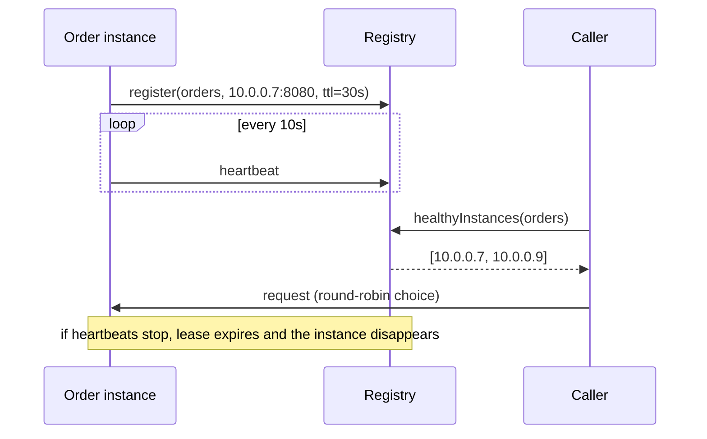

# Service Discovery

**Category:** Communication · **Related:** [API Gateway](01-api-gateway.md), [Service-to-Service Communication](04-service-communication.md)

## Problem

Service instances are created and destroyed continuously by autoscaling, deployments and failures; their
addresses are not known in advance. Hard-coded addresses break on every change.

## Context

Dynamic infrastructure (containers, VMs in autoscaling groups) where callers need to find healthy instances of a
service and spread load across them.

## Solution

Maintain a **registry** of instances and their health. Instances register themselves (or are registered by the
platform) and renew a **lease** via heartbeats; instances that stop renewing are removed automatically.

- **Client-side discovery:** the caller queries the registry and load-balances itself.
- **Server-side discovery:** the caller hits a stable virtual address (load balancer, Kubernetes Service) that
  resolves instances on its behalf.

On Kubernetes, server-side discovery via `Service` + DNS is built in and is usually the right default.

## Architecture



## Example

[`src/discovery/service-registry.ts`](../../src/discovery/service-registry.ts) implements lease-based
registration and a round-robin resolver; [`tests/discovery.test.ts`](../../tests/discovery.test.ts) shows lease
expiry removing an instance that stopped heart-beating.

```ts
const registry = new ServiceRegistry(30_000);
registry.register({ serviceName: "orders", instanceId: "a", host: "10.0.0.7", port: 8080 });
const target = new RoundRobinResolver(registry).resolve("orders");
```

## Advantages

- Instances can come and go without configuration changes.
- Health-aware routing: failed instances stop receiving traffic.
- Client-side discovery enables smarter balancing (zone-aware, least-loaded).

## Trade-offs

- The registry is critical infrastructure; it must be replicated and clients should cache results.
- Lease TTL is a trade-off: short TTLs detect failure faster but increase heartbeat traffic and false positives.
- Client-side discovery requires a library per language.

## When to use

- Self-managed infrastructure without a platform-provided discovery mechanism.
- When you need client-side, metadata-aware routing (canary versions, zones).

## When NOT to use

- On Kubernetes or a managed container platform, use the platform's discovery (DNS + Services) instead of
  running a separate registry.
- Small, static deployments where a load balancer address is sufficient.
