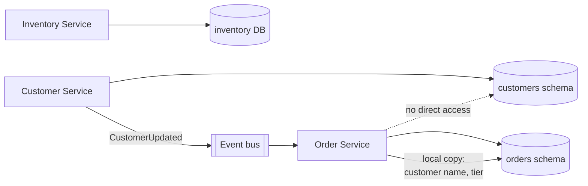

# Database per Service

**Category:** Data · **Related:** [Saga](05-saga.md), [CQRS](08-cqrs.md), [Transactional Outbox](06-transactional-outbox.md)

## Problem

When several services share one database schema, a schema change in one service can break the others, services
cannot be deployed or scaled independently, and the database becomes the hidden coupling point of the system.

## Context

A decomposition into services owned by different teams, each with its own release cadence and data access
patterns.

## Solution

Each service owns its data exclusively. Other services access that data only through the owning service's API or
events it publishes. "Database per service" means *private data*, not necessarily a separate server: separate
schemas with separate credentials on a shared cluster are a common, cheaper starting point.

Data needed by other services is shared by **publishing events**; consumers keep their own local copy
(a read model) of the fields they need.

## Architecture



## Example

The Order Service needs the customer's name and loyalty tier to render an order. Instead of joining the
customer table, it subscribes to `CustomerUpdated` and stores:

```sql
CREATE TABLE order_customer_view (
  customer_id   uuid PRIMARY KEY,
  display_name  text NOT NULL,
  loyalty_tier  text NOT NULL,
  source_version bigint NOT NULL   -- ignore out-of-order events with a lower version
);
```

## Advantages

- Services evolve their schemas independently.
- Each service can choose the storage that fits its access patterns (relational, document, key-value).
- Failure and load isolation between services' data stores.

## Trade-offs

- No cross-service joins or ACID transactions; use [sagas](05-saga.md) and eventual consistency.
- Data duplication and the need to keep replicas in sync via events.
- Reporting across services requires a separate analytics pipeline.

## When to use

- Services owned by different teams with independent release cycles.
- Domains with clearly different data shapes or scaling characteristics.

## When NOT to use

- A small system or a single team — a modular monolith with one database and well-defined module boundaries is
  simpler and gives most of the benefit.
- Domains requiring frequent strongly consistent operations across what would be several services; that is a
  signal the service boundaries are wrong.
