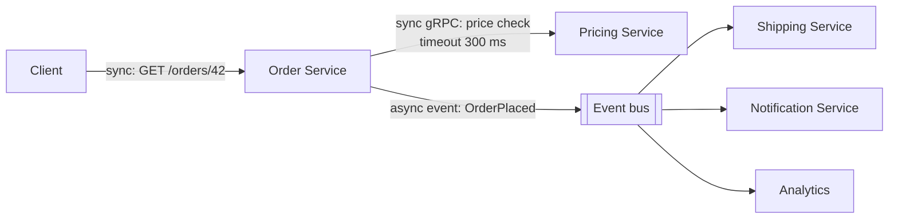

# Service-to-Service Communication

**Category:** Communication · **Related:** [Service Discovery](02-service-discovery.md), [Timeout](12-timeout.md), [Saga](05-saga.md)

## Problem

Services must exchange data and trigger behaviour in each other. Choosing the wrong style couples availability
(one service down takes others down) or makes simple queries needlessly complex.

## Context

A set of services where some interactions need an immediate answer (query, validation) and others represent
something that happened and can be processed later (order placed, asset updated).

## Solution

Choose per interaction:

| Style | Mechanism | Use for | Coupling |
|---|---|---|---|
| Synchronous request/response | HTTP/REST, gRPC | Queries, commands needing an immediate answer | Temporal: caller waits; callee must be up |
| Asynchronous command | Message queue | "Do this" work that may be delayed | Callee can be down temporarily |
| Asynchronous event | Pub/sub topic | "This happened" notifications to any number of consumers | Producer unaware of consumers |

Prefer events for propagating state changes between services, and synchronous calls for queries the user is
waiting on. Avoid long synchronous chains (A → B → C → D): availability multiplies (0.99⁴ ≈ 0.96).

## Architecture



## Example

Contract-first definitions keep both styles explicit:

```proto
// sync: pricing.proto
service Pricing {
  rpc Quote(QuoteRequest) returns (QuoteResponse); // deadline set by caller
}
```

```json
{
  "type": "OrderPlaced",
  "version": 2,
  "id": "6f1c...",
  "correlationId": "c-91ab...",
  "occurredAt": "2026-10-01T10:15:00Z",
  "data": { "orderId": "o-42", "customerId": "c-7", "total": 120.5 }
}
```

## Advantages

- Matching the style to the interaction reduces temporal coupling where it is not needed.
- Events let new consumers be added without changing the producer.
- gRPC gives typed contracts and efficient binary transport for internal calls.

## Trade-offs

- Asynchronous flows are harder to debug; correlation ids and tracing become mandatory.
- Eventual consistency is visible to users and must be designed for.
- Two communication stacks to operate (HTTP/gRPC and a broker).

## When to use

- Always — every distributed system must decide this per interaction. Use the table above as the default.

## When NOT to use

- Do not use asynchronous messaging for queries where the user is waiting for an answer.
- Do not use synchronous calls to propagate state changes to many services; use events.
