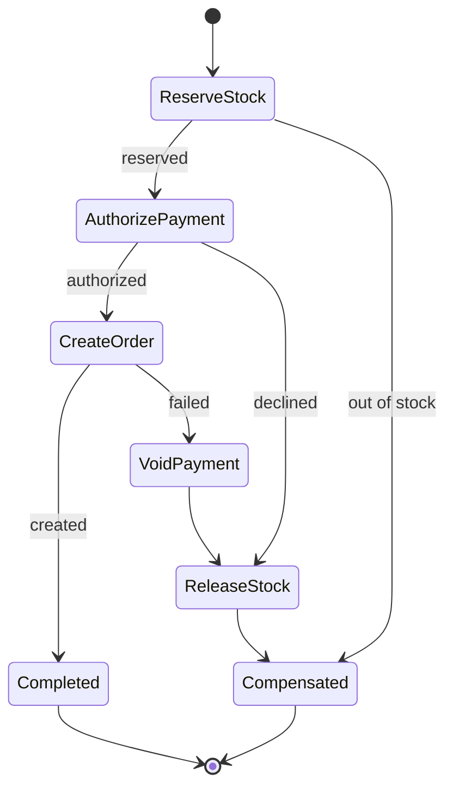

# Saga

**Category:** Data consistency · **Related:** [Distributed Transactions](07-distributed-transactions.md), [Transactional Outbox](06-transactional-outbox.md), [Idempotency](14-idempotency.md)

## Problem

A business operation spans several services, each with its own database (for example: reserve stock, charge
payment, create order). There is no shared transaction, yet the operation must either complete or leave the
system in a consistent state.

## Context

[Database per service](03-database-per-service.md), with business processes that cross service boundaries and
can tolerate intermediate states being briefly visible.

## Solution

Model the operation as a sequence of **local transactions**. Each step has a **compensating action** that
semantically undoes it (release stock, void authorisation). If a step fails, completed steps are compensated in
reverse order.

Two coordination styles:

- **Orchestration:** a saga orchestrator issues commands and tracks state durably.
- **Choreography:** each service reacts to the previous service's event.

Steps and compensations must be **idempotent** because they will be retried.

## Architecture



## Example

[`src/saga/saga.ts`](../../src/saga/saga.ts) is an orchestrator that persists progress after each step, resumes
after a crash, compensates in reverse order with retries, and marks the saga `FAILED` (for manual intervention)
if a compensation cannot succeed. [`examples/checkout-saga.ts`](../../examples/checkout-saga.ts) combines it
with an idempotent API and an outbox.

```ts
const saga = new SagaOrchestrator<Checkout>(
  [
    { name: "reserve-stock", action: reserve, compensate: release },
    { name: "authorize-payment", action: authorize, compensate: voidAuthorization },
    { name: "create-order", action: createOrder },
  ],
  sagaLog,
);
const result = await saga.run(checkoutId, context); // COMPLETED | COMPENSATED | FAILED
```

## Advantages

- Consistency across services without distributed locks or two-phase commit.
- Each service keeps its own transactional boundary and availability.
- Orchestration makes the business process explicit, observable and testable.

## Trade-offs

- Lack of isolation: intermediate states are visible (stock reserved but order not yet created).
- Compensations are business logic and can be hard to define (an email cannot be "unsent").
- More states to test, including compensation failure.

## When to use

- Multi-service business processes where eventual consistency is acceptable.
- Long-running processes (minutes to days) that cannot hold locks.

## When NOT to use

- When all data lives in one database — use a local ACID transaction.
- When the domain truly requires isolation (no observable intermediate state); reconsider service boundaries.
