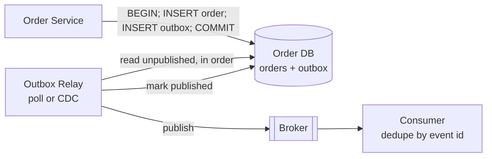

# Transactional Outbox

**Category:** Messaging reliability · **Related:** [Saga](05-saga.md), [Idempotency](14-idempotency.md), [Event Sourcing](09-event-sourcing.md)

## Problem

A service must update its database **and** publish an event. Doing both separately (the *dual write*) means a
crash between them either loses the event or publishes an event for a change that was rolled back.

## Context

Services that publish domain events to a broker (Kafka, RabbitMQ) and whose consumers rely on not missing
events.

## Solution

Write the event to an `outbox` table **in the same local transaction** as the business change. A separate relay
process reads committed outbox rows in order, publishes them and marks them as published. The relay can poll the
table or tail the database's change log (change data capture).

The relay guarantees **at-least-once** publication; consumers deduplicate by event id.

## Architecture



## Example

[`src/outbox/outbox.ts`](../../src/outbox/outbox.ts) — `enqueue(tx, event)` stages the event inside the business
transaction; `OutboxRelay.pollOnce()` publishes in sequence order and stops at the first failure to preserve
ordering. The test suite shows that a rolled-back transaction leaves no event behind.

Equivalent PostgreSQL schema:

```sql
CREATE TABLE outbox (
  id            uuid PRIMARY KEY,
  sequence      bigserial,
  aggregate_type text NOT NULL,
  aggregate_id  text NOT NULL,
  type          text NOT NULL,
  payload       jsonb NOT NULL,
  occurred_at   timestamptz NOT NULL DEFAULT now(),
  published_at  timestamptz
);
CREATE INDEX outbox_unpublished ON outbox (sequence) WHERE published_at IS NULL;
```

## Advantages

- No lost events and no phantom events: publication is tied to the commit.
- Works with any broker; no distributed transaction required.
- Natural place to add ordering, retries and metrics for publication lag.

## Trade-offs

- Duplicates are possible; every consumer must be idempotent.
- Publication latency (poll interval) unless CDC is used.
- The outbox table needs housekeeping (delete or archive published rows).

## When to use

- Any service that changes state and must reliably publish events about it.
- As the publishing mechanism for choreographed sagas.

## When NOT to use

- When losing an occasional event is acceptable (metrics, click tracking) — fire-and-forget is simpler.
- When the system is event-sourced: the event store already *is* the source of events.
