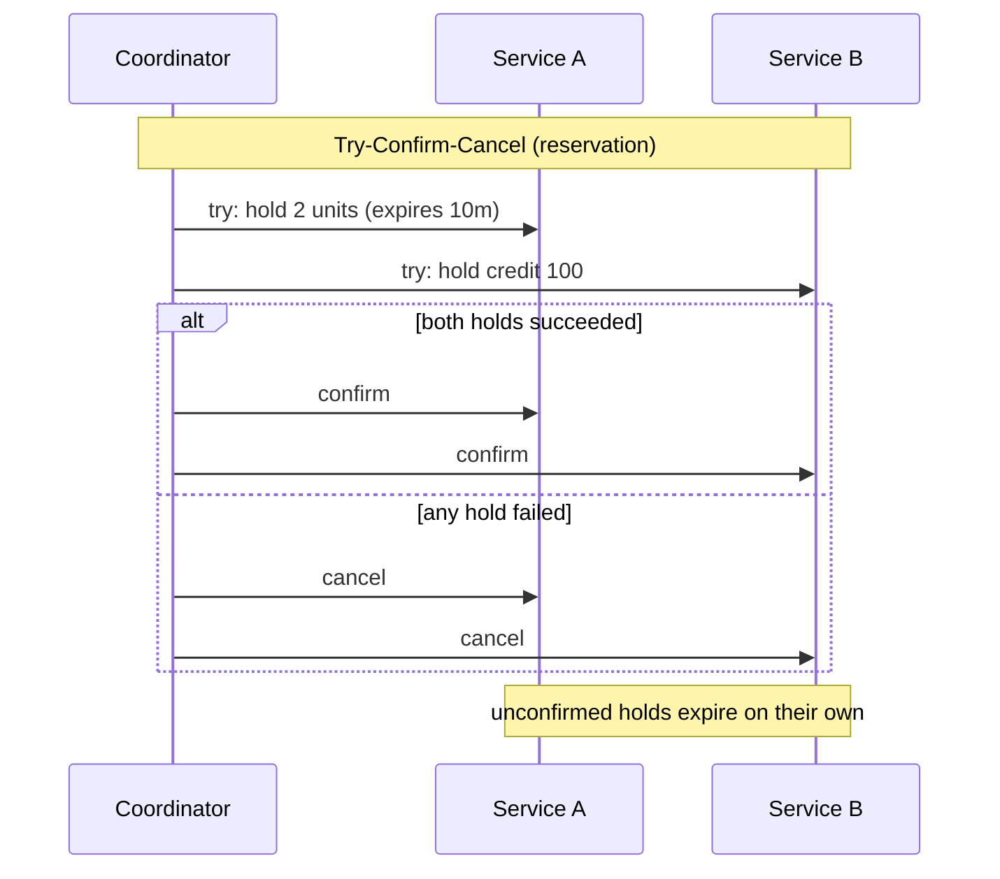

# Distributed Transactions

**Category:** Data consistency · **Related:** [Saga](05-saga.md), [Transactional Outbox](06-transactional-outbox.md), [Database per Service](03-database-per-service.md)

## Problem

An operation must change data owned by several independent resources (databases, brokers, external APIs)
atomically: all changes happen or none do.

## Context

Microservices with private databases, external providers (payments, shipping) that do not participate in
transaction protocols, and high availability requirements.

## Solution

Choose the weakest mechanism that meets the business requirement:

| Approach | Guarantee | Availability impact | Typical use |
|---|---|---|---|
| Two-phase commit (XA) | Atomic, isolated | Blocking; any participant down blocks commit | Within one vendor's ecosystem, few participants |
| Saga (orchestrated/choreographed) | Eventually consistent with compensations | Participants independent | Business processes across services |
| Outbox + idempotent consumers | Atomic *local* change + guaranteed event | Independent | Propagating state changes |
| Reservation / TCC (Try-Confirm-Cancel) | Tentative hold then confirm | Independent; holds expire | Inventory, seats, credit limits |

In microservices, 2PC is generally avoided: it couples the availability of all participants, holds locks across
network calls, and is not supported by most brokers, NoSQL stores or SaaS APIs.

## Architecture



## Example

The reservation step in [`examples/checkout-saga.ts`](../../examples/checkout-saga.ts) is a simplified TCC
"try"; the compensation is the "cancel". A SQL reservation that is safe under concurrency:

```sql
UPDATE stock SET reserved = reserved + :qty
 WHERE sku = :sku AND on_hand - reserved >= :qty;   -- 0 rows => cannot reserve
```

## Advantages

- Sagas/TCC keep services available independently.
- Expiring reservations self-heal when a coordinator crashes.
- Outbox removes the most common inconsistency (dual write) cheaply.

## Trade-offs

- Weaker isolation than 2PC; intermediate states are observable.
- More application code: compensations, expiry sweepers, reconciliation jobs.
- Requires idempotency everywhere.

## When to use

- Use this comparison whenever an operation crosses data ownership boundaries.

## When NOT to use

- If you find many operations need atomic multi-service updates, the boundaries are probably wrong; merge the
  services or move the data.
