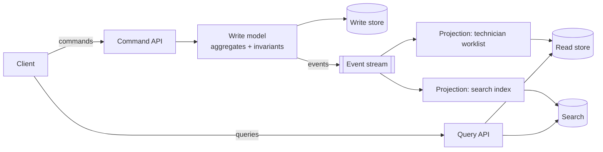

# CQRS (Command Query Responsibility Segregation)

**Category:** Data · **Related:** [Event Sourcing](09-event-sourcing.md), [Database per Service](03-database-per-service.md)

## Problem

A single model optimised for enforcing business rules on writes is awkward and slow for the variety of queries
users need (dashboards, search, worklists that join data from several aggregates or services).

## Context

Read and write workloads differ significantly in shape or volume — for example many reads of denormalised lists
versus few writes with complex validation.

## Solution

Separate the **write model** (commands, invariants, transactions) from one or more **read models** (projections
denormalised for specific queries). Read models are updated from events emitted by the write side and are
therefore eventually consistent. Each read model can use the store that best fits its query (relational table,
search index, cache).

## Architecture

## Example

[`src/event-sourcing/projection.ts`](../../src/event-sourcing/projection.ts) builds an "open work orders by
technician" read model from work-order events. It stores a **checkpoint** so catch-up is idempotent and can be
rebuilt from scratch by resetting the checkpoint.

## Advantages

- Queries become simple lookups against data shaped for them.
- Read and write sides scale independently.
- New read models can be added (and rebuilt from history) without touching the write side.

## Trade-offs

- Eventual consistency between a command and the read model; UIs must handle "your change is processing".
- More moving parts: projections, checkpoints, rebuild procedures.
- Duplicated data across stores.

## When to use

- Complex domains where write-side rules and read-side views diverge.
- High read/write asymmetry, or reads that need a different store (search, analytics).

## When NOT to use

- CRUD-style domains where the same shape serves reads and writes — CQRS adds complexity for no benefit.
- Where users require immediate read-after-write consistency on every screen.
