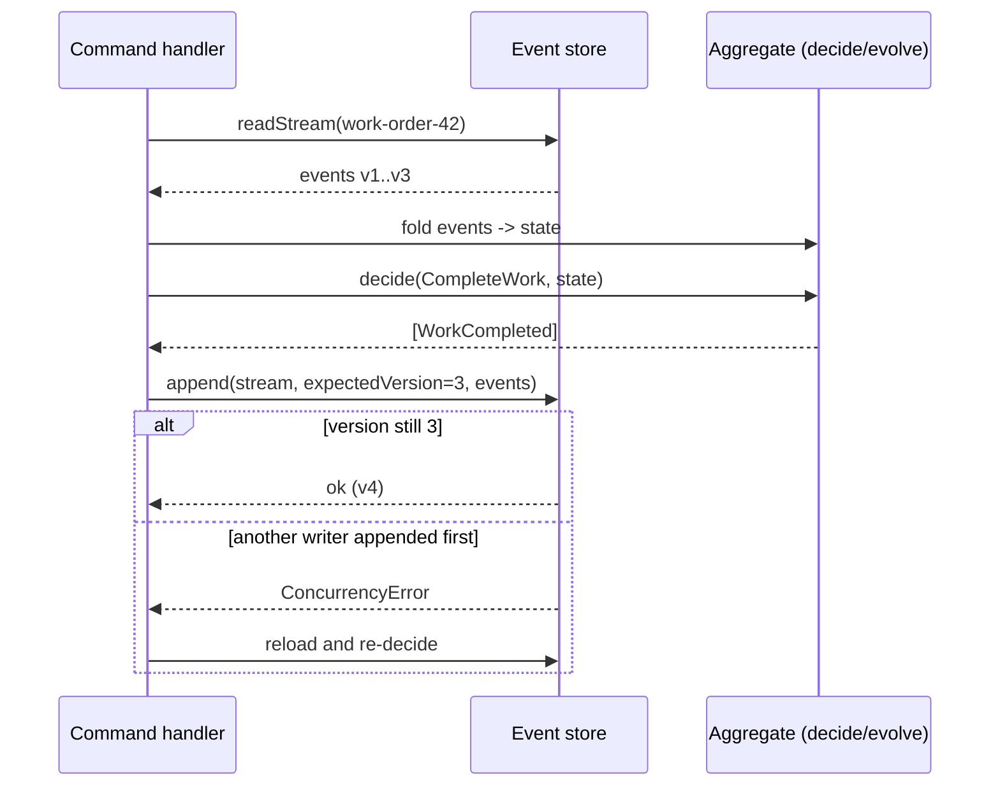

# Event Sourcing

**Category:** Data · **Related:** [CQRS](08-cqrs.md), [Transactional Outbox](06-transactional-outbox.md)

## Problem

Storing only the current state loses *how* the state was reached. Audit trails bolted on afterwards drift from
reality, and it is impossible to answer "what did we know at time T?" or to build a new view over history.

## Context

Domains where history is a first-class requirement (audit, compliance, maintenance history of assets, financial
ledgers) or where many different read models are derived from the same changes.

## Solution

Persist each change as an immutable **event** in an append-only stream per aggregate. Current state is derived
by folding the events (`evolve`). Commands are validated against the current state (`decide`) and produce new
events, appended with **optimistic concurrency** (expected stream version). Read models are built as
[CQRS](08-cqrs.md) projections. Snapshots bound replay time for long streams.

## Architecture



## Example

[`src/event-sourcing/`](../../src/event-sourcing) models an EAM maintenance **work order**
(`WorkOrderCreated → TechnicianAssigned → WorkStarted → WorkCompleted`) with pure `decide`/`evolve` functions,
an in-memory event store with optimistic concurrency, and a command handler that re-evaluates on conflicts.

```ts
await handleCommand(store, { type: "CompleteWork", workOrderId: "42", at: now, laborHours: 2.5 });
```

## Advantages

- Complete, trustworthy audit history by construction.
- Temporal queries and the ability to build new projections from past events.
- Pure decide/evolve functions are trivial to unit test.

## Trade-offs

- Event schemas are forever: versioning and upcasting are required as the model evolves.
- Querying current state requires projections; ad-hoc queries are harder.
- Steeper learning curve; GDPR erasure needs crypto-shredding or similar techniques.

## When to use

- Audit-heavy domains and domains where history drives behaviour (maintenance history, ledgers).
- When several read models need to be derived from the same stream of changes.

## When NOT to use

- Simple CRUD data with no historical requirements.
- Teams without capacity to manage event versioning and projection rebuilds.
