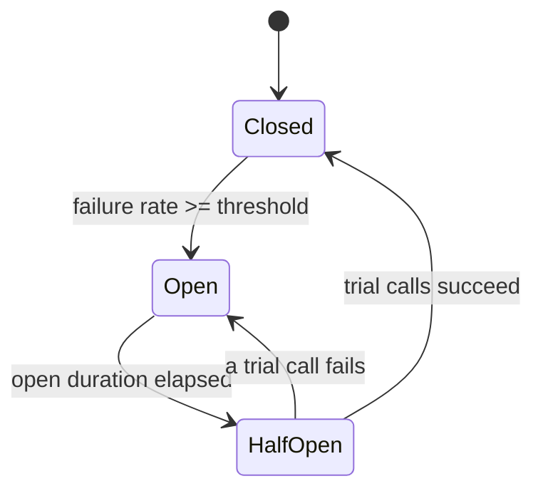

# Circuit Breaker

**Category:** Resilience · **Related:** [Retry](11-retry.md), [Timeout](12-timeout.md), [Bulkhead](13-bulkhead.md)

## Problem

When a dependency is failing or very slow, callers keep sending requests that will fail anyway. This wastes
threads and connections, adds latency for users, and prevents the dependency from recovering.

## Context

Synchronous calls to remote dependencies (services, databases, third-party APIs) that can fail for extended
periods.

## Solution

Wrap calls in a state machine:

- **CLOSED** — calls pass through; outcomes are recorded in a sliding window.
- **OPEN** — when the failure rate crosses a threshold, calls fail immediately without reaching the dependency.
- **HALF_OPEN** — after a cool-down, a limited number of trial calls are allowed; success closes the circuit,
  failure re-opens it.

Only dependency failures should count — a 400 validation error does not mean the dependency is unhealthy.
Combine with a fallback (cached data, default response, degraded feature) where possible.

## Architecture



## Example

[`src/resilience/circuit-breaker.ts`](../../src/resilience/circuit-breaker.ts) — a count-based sliding-window
breaker with an injectable clock and an `isFailure` classifier. Run the composed demo:

```bash
npm run build && node dist/examples/resilient-client.js
```

```text
request 1: FAILED - gave up after 3 attempts: operation timed out after 30 ms
  [breaker] CLOSED -> OPEN
request 2: FAILED - rejected fast (circuit open)
  [breaker] OPEN -> HALF_OPEN
  [breaker] HALF_OPEN -> CLOSED
request 4: stock=42 (call 5)
```

## Advantages

- Fails fast, protecting caller resources and user latency.
- Gives the dependency room to recover instead of being hammered.
- State changes are a strong operational signal (alert on OPEN).

## Trade-offs

- Thresholds need tuning per dependency; poorly tuned breakers flap or never trip.
- Per-instance breakers see only local traffic; with many instances each must learn independently.
- Fallbacks add code paths that must be tested.

## When to use

- Every synchronous call to a remote dependency on a user-facing path.

## When NOT to use

- In-process calls or local resources.
- Asynchronous consumers, where back-off and pausing consumption achieve the same effect more simply.
