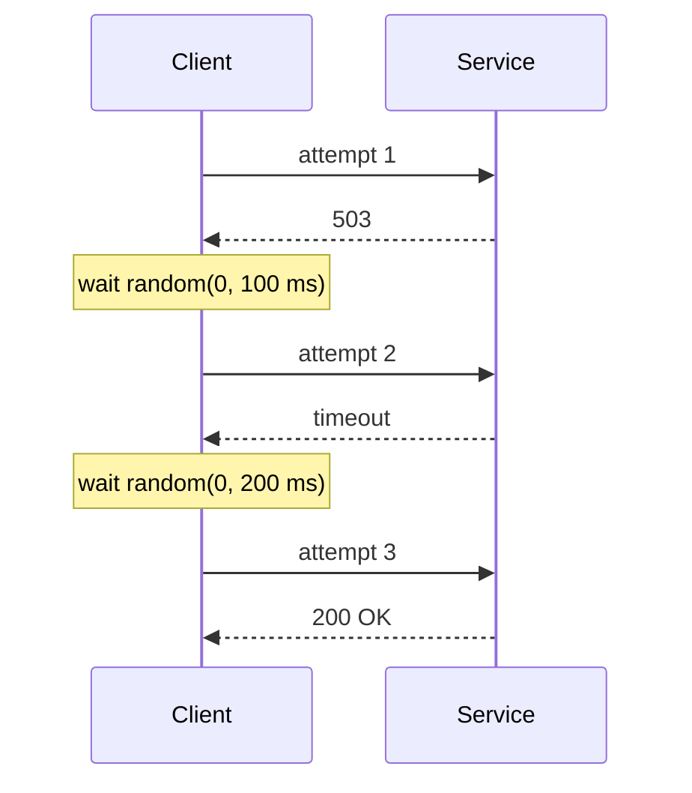

# Retry

**Category:** Resilience · **Related:** [Idempotency](14-idempotency.md), [Circuit Breaker](10-circuit-breaker.md), [Timeout](12-timeout.md)

## Problem

Many failures in distributed systems are transient: a dropped connection, a leader election, a brief overload.
Failing the whole operation on the first error makes the system needlessly fragile.

## Context

Remote calls whose failures are often temporary, and whose operations are idempotent or protected by an
idempotency key.

## Solution

Retry a bounded number of times with **exponential backoff and jitter**. Classify errors: retry timeouts,
connection errors, 429 and 503; never retry 400/401/403/404/409 or business errors. Honour `Retry-After` when the
server provides it. Retry at **one** layer of the stack only, to avoid multiplicative retry storms.

Full jitter: `delay = random(0, min(cap, base × 2^(attempt−1)))`.

## Architecture



## Example

[`src/resilience/retry.ts`](../../src/resilience/retry.ts) with injectable `random` and `sleep` for
deterministic tests:

```ts
await retry(() => inventory.get(sku), {
  maxAttempts: 3,
  baseDelayMs: 100,
  maxDelayMs: 2_000,
  isRetryable: (e) => e instanceof TimeoutError || (e instanceof HttpError && [429, 503].includes(e.status)),
});
```

## Advantages

- Masks transient faults cheaply.
- Jitter prevents synchronized retry waves from many clients.

## Trade-offs

- Increases load on an already struggling dependency; must be paired with a circuit breaker and retry budgets.
- Unsafe for non-idempotent operations — can double-charge or double-create.
- Increases tail latency for the caller.

## When to use

- Idempotent operations against dependencies with transient failure modes.

## When NOT to use

- Non-idempotent operations without an idempotency key.
- When the caller has a tight deadline that a retry cannot fit into.
- At several layers simultaneously (client, gateway, service) — pick one.
