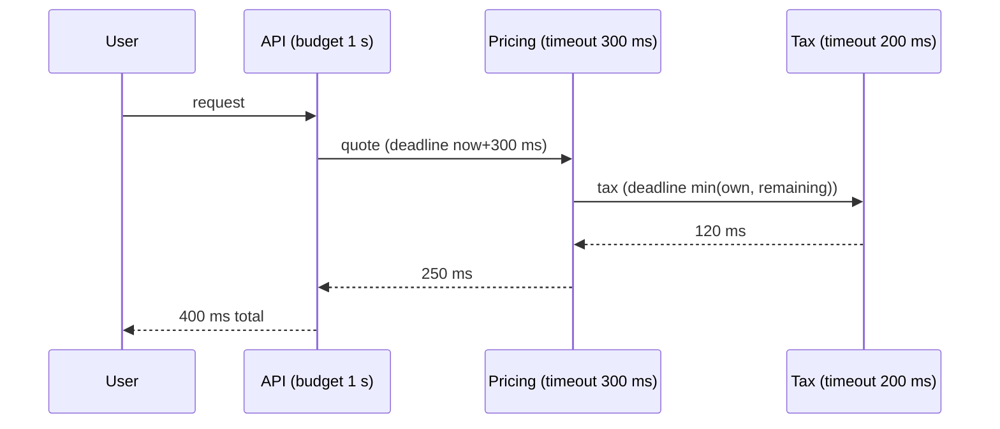

# Timeout

**Category:** Resilience · **Related:** [Circuit Breaker](10-circuit-breaker.md), [Bulkhead](13-bulkhead.md), [Retry](11-retry.md)

## Problem

A call without a deadline can wait forever. One slow dependency then holds connections, threads and memory in
every caller until the whole chain stalls — slow is often worse than down.

## Context

Any network call: HTTP, gRPC, database queries, cache lookups, broker publishes.

## Solution

Give every remote call an explicit timeout derived from the dependency's latency profile (e.g. its p99.9 plus
margin) and the caller's own budget. Propagate **deadlines** downstream (gRPC deadlines, an
`X-Request-Deadline` header) so inner calls do not keep working after the outer request has already given up.
Cancel the underlying work when the timeout fires, rather than merely ignoring the result.

## Architecture



## Example

[`src/resilience/timeout.ts`](../../src/resilience/timeout.ts) passes an `AbortSignal` to the operation so
`fetch` and modern drivers actually cancel the request:

```ts
const quote = await withTimeout((signal) => fetch(`${pricingUrl}/quote`, { signal }), 300);
```

## Advantages

- Bounds resource usage and user-facing latency.
- Converts "hanging" into a fast, handleable error.

## Trade-offs

- Too short: false failures under normal load spikes. Too long: little protection.
- A timed-out request may still have succeeded on the server — non-idempotent operations need reconciliation.

## When to use

- Always, on every remote call. There is no good default of "infinite".

## When NOT to use

- Not applicable as an opt-out; the question is only the value. For long-running work, switch to an
  asynchronous job with status polling instead of a long timeout.
