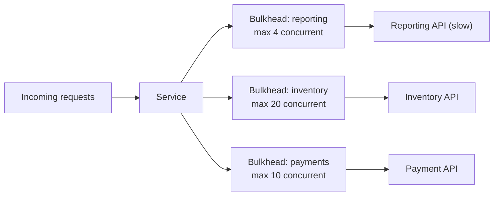

# Bulkhead

**Category:** Resilience · **Related:** [Circuit Breaker](10-circuit-breaker.md), [Timeout](12-timeout.md)

## Problem

A service shares one pool of connections/workers across all its dependencies. When one dependency becomes slow,
requests to it consume the entire pool and unrelated features (that do not use that dependency) fail too.

## Context

Services that call several dependencies with different reliability, or that serve several tenants/features whose
failures should be isolated.

## Solution

Partition resources into isolated compartments, like the watertight bulkheads of a ship: a separate concurrency
limit (semaphore), connection pool or thread pool per dependency, per tenant tier or per feature. When a
compartment is full, new calls queue briefly or are rejected immediately.

## Architecture



## Example

[`src/resilience/bulkhead.ts`](../../src/resilience/bulkhead.ts) — a semaphore with a bounded wait queue:

```ts
const reporting = new Bulkhead({ name: "reporting", maxConcurrent: 4, maxQueue: 10 });
await reporting.execute(() => reportingApi.generate(request)); // BulkheadRejectedError when full
```

## Advantages

- Contains the blast radius of a slow dependency or a noisy tenant.
- Rejections are an early, explicit overload signal.

## Trade-offs

- Capacity is partitioned, so overall utilisation can be lower.
- Limits need sizing (Little's law: concurrency ≈ throughput × latency) and revisiting as traffic changes.

## When to use

- Services with dependencies of mixed reliability on the same request path.
- Multi-tenant systems that must prevent one tenant from starving others.

## When NOT to use

- Services with a single dependency, where the bulkhead equals the overall limit.
- When the platform already isolates (separate deployments per workload) at lower cost.
