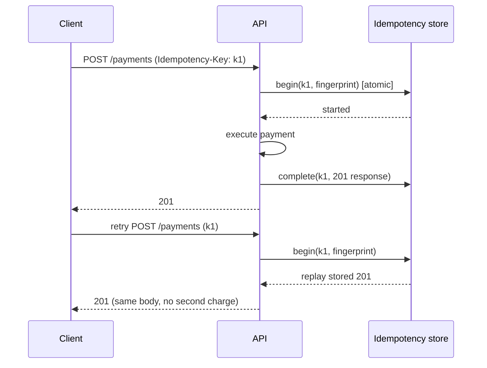

# Idempotency

**Category:** Reliability · **Related:** [Retry](11-retry.md), [Transactional Outbox](06-transactional-outbox.md), [Saga](05-saga.md)

## Problem

Networks force retries: clients retry after timeouts, brokers redeliver messages, sagas resume after crashes. If
the receiving operation is not idempotent, retries create duplicate orders, payments or notifications.

## Context

Any operation that can be invoked more than once for the same intent: POST APIs, message consumers, saga steps.

## Solution

Make repeated execution have the same effect as a single execution:

- **APIs:** the client sends an `Idempotency-Key`. The server atomically records the key with a request
  fingerprint, executes once, stores the response and replays it for repeats. Same key + different body is a
  client error (422); same key while still processing is a conflict (409).
- **Consumers:** store processed message ids in the same transaction as the side effect (inbox/dedup table).
- **Natural idempotency:** prefer absolute updates (`SET status = 'SHIPPED'`) over relative ones
  (`balance = balance - 10`).

## Architecture



## Example

[`src/idempotency/idempotency.ts`](../../src/idempotency/idempotency.ts) implements the key lifecycle, request
fingerprinting (canonical JSON) and TTL. 5xx responses and thrown errors release the key so the client can retry.
A PostgreSQL implementation would use:

```sql
INSERT INTO idempotency_keys (key, fingerprint, state, expires_at)
VALUES ($1, $2, 'IN_PROGRESS', now() + interval '24 hours')
ON CONFLICT (key) DO NOTHING;   -- 0 rows => existing key: replay, 409 or 422
```

## Advantages

- Makes retries safe, which in turn makes at-least-once delivery usable.
- Gives clients a simple, standard contract.

## Trade-offs

- Storage and an extra round-trip per request.
- Choosing what to cache (only definitive outcomes) and for how long requires care.

## When to use

- All non-naturally-idempotent write APIs, especially those involving money or external side effects.
- All message consumers in at-least-once systems.

## When NOT to use

- Read-only operations and naturally idempotent writes (`PUT` of a full resource) — they already are.
