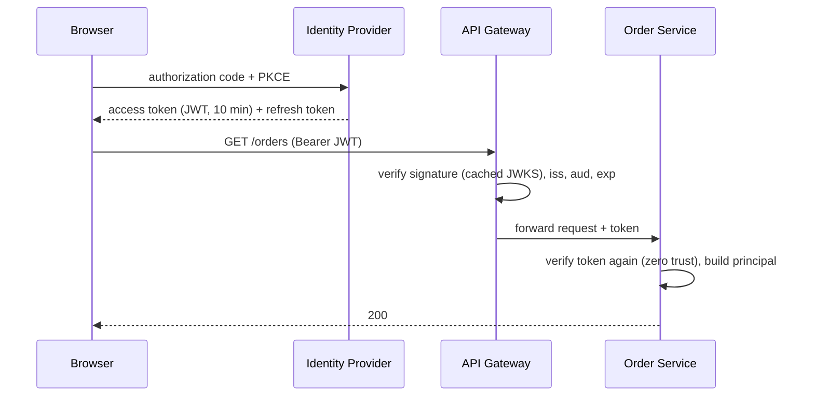

# Authentication

**Category:** Security · **Related:** [API Gateway](01-api-gateway.md), [Authorization](16-authorization.md)

## Problem

Every service must know *who* is calling — an end user, another service, or a partner — without each service
implementing login, password storage and session management.

## Context

Many services, several client types, possibly enterprise SSO; tokens must be verifiable without a central call
on every request.

## Solution

Delegate authentication to an **identity provider** using **OpenID Connect / OAuth 2.0**:

- Users authenticate with the IdP (authorization code flow with PKCE for browser and mobile apps).
- Clients send short-lived **access tokens** (JWT) to the gateway.
- The gateway **and** each service verify the token signature against the IdP's JWKS, plus `iss`, `aud`, `exp`.
- Service-to-service calls use the **client credentials** flow or mTLS (often via a service mesh); for calls on a
  user's behalf, use token exchange so the downstream service still knows the user.

## Architecture



## Example

Token verification with `jose` (Node.js):

```ts
import { createRemoteJWKSet, jwtVerify } from "jose";

const jwks = createRemoteJWKSet(new URL("https://idp.example.com/.well-known/jwks.json"));
export async function authenticate(bearer: string) {
  const { payload } = await jwtVerify(bearer, jwks, {
    issuer: "https://idp.example.com/",
    audience: "orders-api",
    algorithms: ["RS256"],
  });
  return { userId: payload.sub!, scopes: String(payload.scope ?? "").split(" ") };
}
```

A complete tenant-aware implementation is in
[enterprise-saas-platform](https://github.com/shivkumarsinghsky/enterprise-saas-platform).

## Advantages

- No credentials handled by business services; SSO and MFA come from the IdP.
- Stateless verification scales horizontally.

## Trade-offs

- JWTs cannot be revoked instantly; keep them short-lived and use refresh tokens.
- Key rotation and JWKS caching must be handled correctly.
- Token size grows with claims; avoid stuffing permissions into tokens.

## When to use

- Any system with more than one service or client type.

## When NOT to use

- Do not build your own password/session system for a microservices platform; use a proven IdP.
