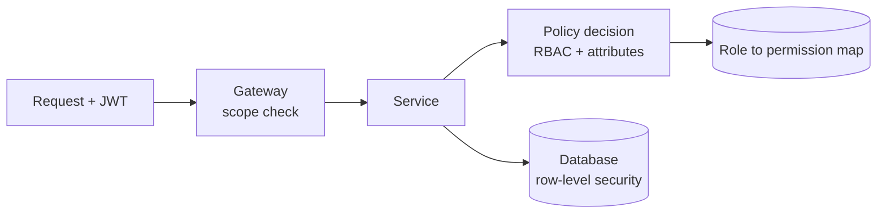

# Authorization

**Category:** Security · **Related:** [Authentication](15-authentication.md), [API Gateway](01-api-gateway.md)

## Problem

Knowing who the caller is does not answer what they may do. Coarse checks at the gateway cannot see resource
ownership, tenant boundaries or business state, and authorization logic scattered through code drifts.

## Context

Services exposing operations on resources owned by users, teams or tenants, with role-based and sometimes
attribute-based rules.

## Solution

Layer authorization:

1. **Gateway:** coarse checks — valid token, required scope for the API (`orders:read`).
2. **Service:** fine-grained checks where the data lives — role/permission (RBAC), ownership and tenant match
   (ABAC/ReBAC), business state (cannot cancel a shipped order).
3. **Data layer:** defence in depth — tenant filters or row-level security.

Express rules as **permissions** (`workorders:approve`) mapped from roles, evaluated by one policy component
(library or policy engine such as OPA), never ad hoc `if (user.role === "admin")` checks.

## Architecture



## Example

```ts
type Permission = "workorders:read" | "workorders:write" | "workorders:approve";

function authorize(principal: Principal, permission: Permission, resource: { tenantId: string }) {
  if (principal.tenantId !== resource.tenantId) throw new ForbiddenError("cross-tenant access");
  if (!principal.permissions.has(permission)) throw new ForbiddenError(`missing ${permission}`);
}
```

Tenant-aware RBAC with PostgreSQL row-level security is implemented in
[enterprise-saas-platform](https://github.com/shivkumarsinghsky/enterprise-saas-platform).

## Advantages

- Decisions are made where the necessary context exists.
- Central policy definitions are auditable and testable.
- Defence in depth limits the impact of a single missed check.

## Trade-offs

- Permission data must be available to every service (cached, event-synchronised).
- Policy engines add latency and an operational component.

## When to use

- Always for multi-user systems; ABAC/ReBAC when ownership and relationships drive access.

## When NOT to use

- Do not rely on gateway-only authorization for resource-level decisions.
