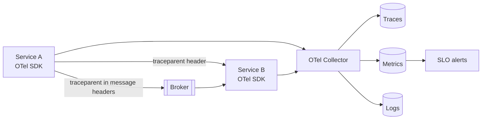

# Observability

**Category:** Operations · **Related:** [API Gateway](01-api-gateway.md), [Circuit Breaker](10-circuit-breaker.md)

## Problem

A single user request crosses many services and queues. Without correlated telemetry, finding where it failed
or why it was slow means guessing across dozens of log streams.

## Context

Distributed systems in production, where incidents must be detected from symptoms and diagnosed quickly.

## Solution

Instrument every service with the three signals, correlated by trace and correlation ids:

- **Structured logs** (JSON) with `traceId`, `correlationId`, `tenantId`, `service`, `version`.
- **Metrics:** RED (rate, errors, duration) per endpoint and dependency; USE for resources; business metrics.
- **Distributed traces:** W3C `traceparent` propagated over HTTP/gRPC **and in message headers**.

Use **OpenTelemetry** SDKs and the OTel Collector to stay vendor-neutral. Expose `/health/live` (process is
running) and `/health/ready` (dependencies needed to serve are available). Alert on SLO burn rates, not on
individual errors.

## Architecture



## Example

```json
{"level":"error","time":"2026-10-01T10:15:02.120Z","service":"order-service","version":"1.8.2",
 "traceId":"4bf92f3577b34da6a3ce929d0e0e4736","correlationId":"c-91ab","tenantId":"t-17",
 "msg":"payment authorization failed","dependency":"payment-api","durationMs":2003,"error":"TimeoutError"}
```

Runnable instrumentation (correlation ids through HTTP and broker headers, health endpoints) is in
[event-driven-platform](https://github.com/shivkumarsinghsky/event-driven-platform).

## Advantages

- Faster detection and diagnosis; traces show the slow hop directly.
- SLO-based alerting reduces noise and focuses on user impact.

## Trade-offs

- Telemetry volume and cost; requires sampling and cardinality discipline (no user ids as metric labels).
- Instrumentation must be maintained as code evolves.

## When to use

- Every service intended to run beyond a demo.

## When NOT to use

- Not optional in distributed systems; scale the depth (sampling rates, retention) to the system's criticality.
